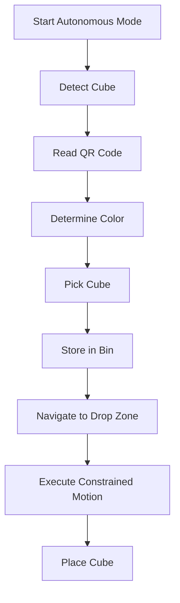

# 🚀 Modular Omni-Wheel Mobile Manipulator  
### 🏆 Spring 2026 Mechatronics Omni-Challenge  
*MCT333 / MCT344 – Mechatronic Systems Design*  
Ain Shams University – Faculty of Engineering  

---

<p align="center">


</p>

---

## 📸 Project Preview

<p align="center">
  
</p>

> Replace the image above with your CAD render or real robot photo.

---

# 📌 Overview

This project presents a **modular omni-directional mobile manipulator robot** designed for autonomous sorting and delivery of QR-coded cubes.

The robot integrates:

- 🛞 Holonomic omni-wheel drive
- 🦾 Robotic manipulator with gripper
- 🎥 QR-code based color detection
- 🧠 Autonomous state machine
- 🔋 Fully onboard power system
- 🔌 Plug-and-play modular architecture

---

# 🎯 Mission Objective

1. Manually navigate through a marked lane.
2. Switch to autonomous mode.
3. Pick up a QR-coded cube (5×5×5 cm).
4. Detect encoded color.
5. Store cube in correct onboard bin.
6. Deliver to correct drop-off zone using:
   - Pure Y motion
   - Pure X motion
   - Rotation in place

---

# 🏗 System Architecture

## 🔹 Modular Design

```
Mobile Base Module  <----->  Manipulator Module
       |                          |
   Motor Control              Arm Control
   Encoders                   Gripper
   IMU                        Vision
```

---

## 🛞 Mobile Base

- 3/4 Omni wheels
- Holonomic kinematics
- Encoder-based odometry
- IMU stabilization
- Independent controller
- Dedicated power board

---

## 🦾 Manipulator

- Multi-DOF arm
- Servo/DC actuation
- Custom gripper
- 40 cm pickup height capability
- Independent controller

---

# ⚙️ Technical Specifications

| Parameter | Value |
|------------|--------|
| Max Weight | < 10 kg |
| Max Dimensions (Folded) | 50 × 50 × 70 cm |
| Cube Size | 5 × 5 × 5 cm |
| Pickup Height | ~40 cm |
| Power Source | Battery |
| Motion | Holonomic (X, Y, Rotation) |

---

# 🧠 Software Stack

## 🔸 Control
- Holonomic forward/inverse kinematics
- PID motor control
- Encoder odometry
- IMU heading correction
- Autonomous state machine

## 🔸 Perception
- Camera-based QR detection
- Color decoding
- Sorting logic

---

# 🔄 Autonomous Flow



---

# 📐 Design Methodology

This project follows **VDI 2206 Mechatronic V-Model**:

✔ Requirements Definition  
✔ Functional Decomposition  
✔ TRIZ Concept Innovation  
✔ Actuator Sizing  
✔ Modeling & Simulation  
✔ Subsystem Verification  
✔ Full Integration & Testing  

---

# 🔬 Modeling & Simulation

- Holonomic kinematics validation
- Torque & power calculations
- Arm joint analysis
- Control loop simulation
- Perception validation

---

# 🔒 Safety Features

- Main fuse protection
- Emergency stop
- Enclosed PCB
- Professional wiring harness
- No exposed terminals
- Dimension compliance check


---

# 🏁 Competition Performance Criteria

- Manual navigation accuracy
- Autonomous pickup success
- Correct bin sorting
- Correct drop-off
- No penalties (lane crossing, collisions)
- Repeatability

---

# 🛠 Tools & Technologies

- Inventor / Fusion 360
- MATLAB / Simulink
- Embedded C/C++
- Python (OpenCV, QR detection)
- Git
- 3D Printing / Laser Cutting


---

# 👥 Team

| Role | Name |
|------|------|
| Project Manager |Nouran Mohamed Hassan|
| Mechanical Lead |Mohammed Ibrahim |
| Electronics Lead | Nouran Mohamed Hassan|
| Embedded Lead | Hanan Ahmed|
| Perciption Lead | Malak Sherif|
| Actuation & Power Lead |Heba Rabea |
| Controls & Estimation Lead | Fady Ramy |

---

# ✨ Future Improvements

- EKF sensor fusion
- SLAM integration
- ROS-based modular architecture
- Improved gripper compliance
- Advanced obstacle avoidance


---

<p align="center">
Made with ⚙️, 🤖 and ☕ by the Mechatronics Team
</p>
